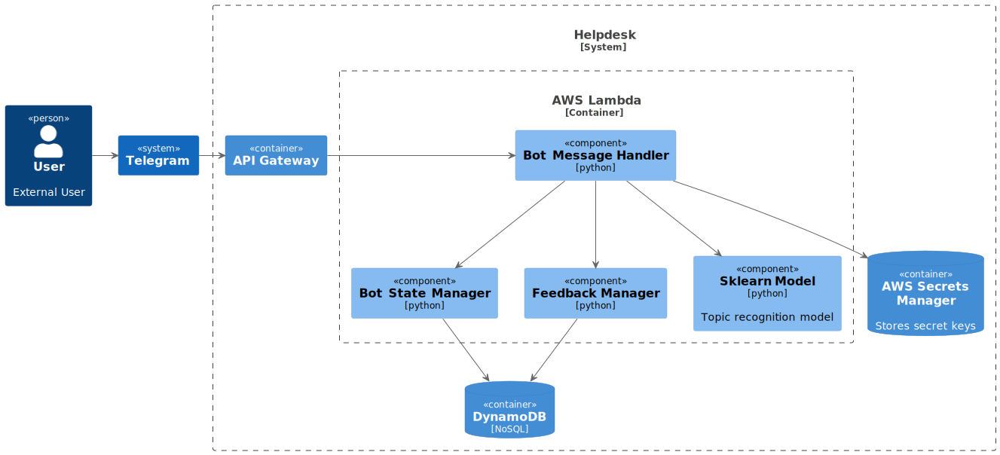

# SE Migrant Helpdesk

This is a repo with my Master's research study that employed User-Centered Design (UCD) and participatory design (PD) principles to explore the frequently asked questions and prevalent needs of new migrants. The objective was to develop a prototype of an information system that effectively addressed and fulfilled these identified needs. The research process involved conducting workshops and engaging with new migrant participants to gather their insights and perspectives. By incorporating their input, a comprehensive understanding of the migrants' concerns and requirements was obtained. Using this knowledge, a prototype of an informational system in the form of a Telegram Bot was designed and implemented to provide accessible and relevant information to new migrants, facilitating their integration into Swedish society. The prototype underwent user evaluation, and although some suggested improvements were identified, the overall response was positive. This study highlights the value of UCD and PD in creating user-centric solutions that meet the specific needs of new migrants, enabling them to access essential information and support during their integration process.

*ChatBot Prototype. C4 - Component diagram*

## Repo Map
 - The final version of [thesis](Thesis.pdf) 
 - Documentation 
   - [System Design Process](docs/README.md)
   - [Data collection](data-collection/README.md) from Reddit
   - [Notebook with NLP](nlp/README.MD) (Natural Language Processing) of data from Reddit
   - [Telegram Bot](bot/README.md) code and development process
